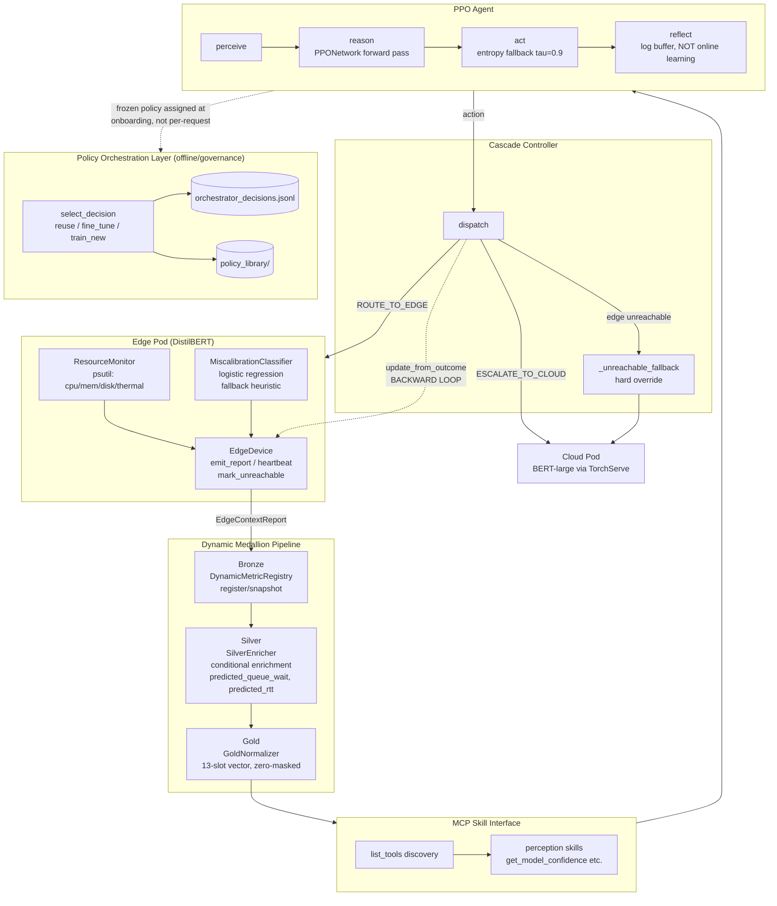
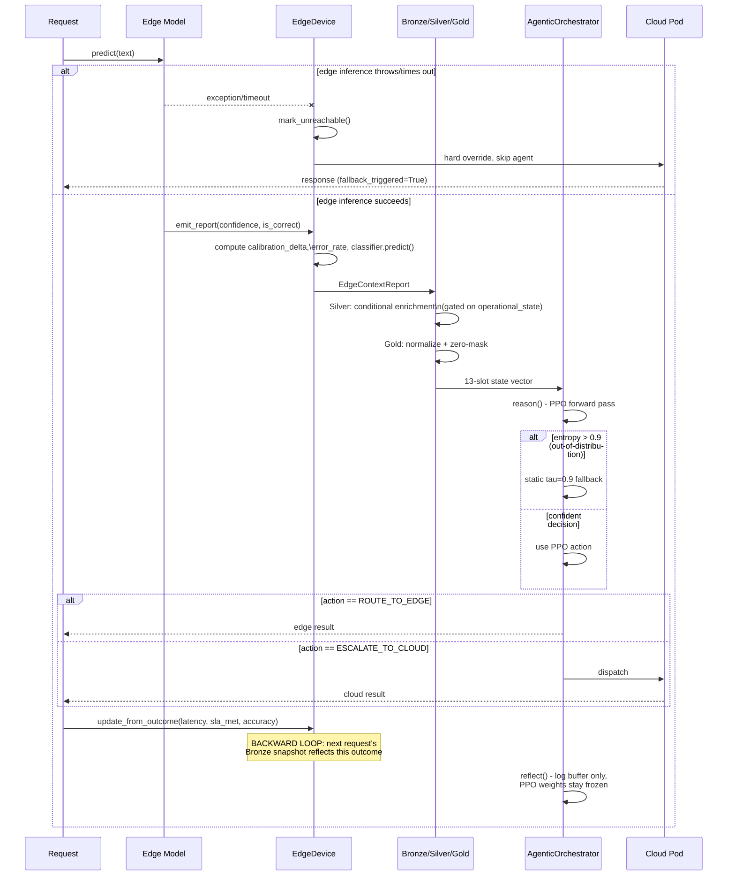
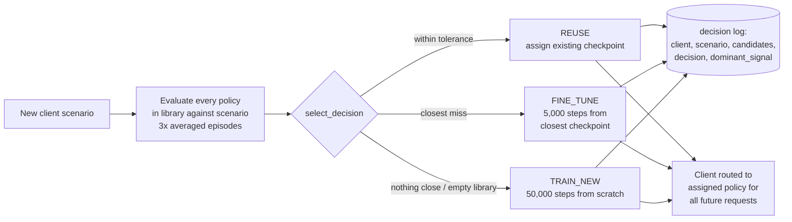
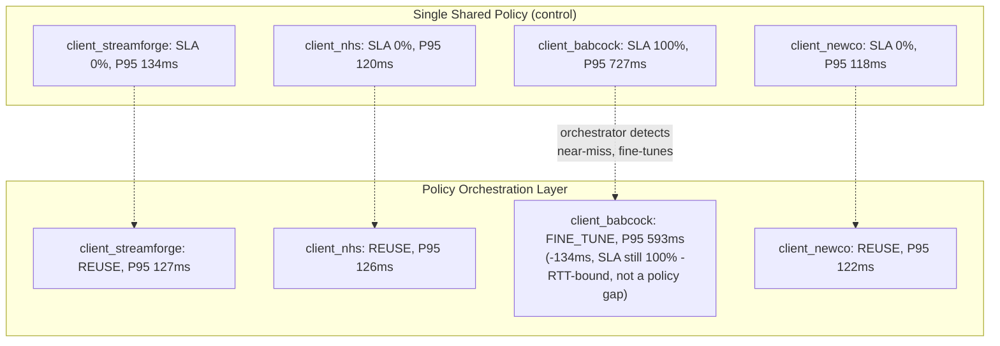

# System Diagrams

## 1. System design — the 7 locked components

**Reading this**: the top three subgraphs (Edge, Medallion, MCP) are the
**forward** perception path; Agent + Cascade are decision + dispatch; the
dotted line back into `EdgeDevice` is the **backward** loop (Component 6) —
note it updates edge state, not the policy weights. The Policy Orchestration
Layer (Component 7) sits outside the per-request path entirely — it assigns
which frozen policy a client's traffic gets routed through at onboarding
time, never inside a single request's decision.

---

## 2. Per-request workflow — perceive/reason/act/reflect

---

## 3. Policy Orchestration Layer — governance-time decision flow

**Tolerance thresholds** (`orchestrator.py`): `max_sla_violation_rate=0.15,
min_accuracy=0.80, max_escalation_rate=0.60`. This is a governance-time,
offline decision — it never runs inside the synchronous per-request path in
diagram 2.

---

## 4. Ablation Run 7 result, current run

